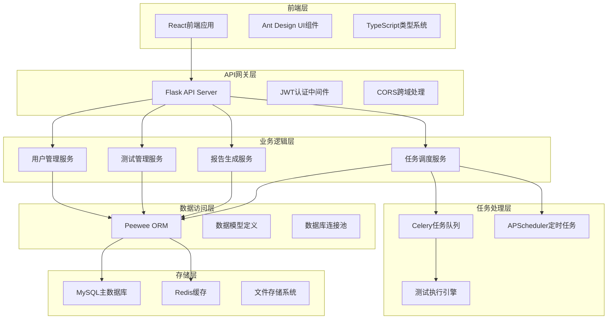
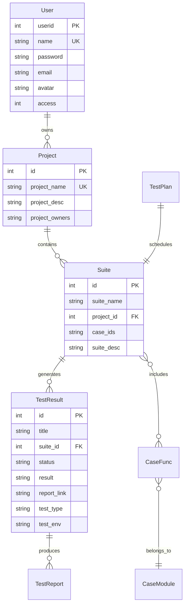

# 🏛️ 系统架构设计

> 深入了解Flask Plant测试平台的设计理念和技术架构 🎯

## 🎨 设计理念

### 核心设计原则

**1. 简单性 (Simplicity)**
- 复杂的功能，简单的操作
- 直观的用户界面和API设计
- 最小化学习成本

**2. 可扩展性 (Scalability)**
- 模块化的架构设计
- 支持水平扩展
- 插件化的功能扩展

**3. 可靠性 (Reliability)**
- 完善的错误处理机制
- 数据一致性保障
- 系统容错能力

**4. 高性能 (Performance)**
- 异步任务处理
- 缓存策略优化
- 数据库查询优化

## 🏗️ 整体架构

### 系统架构图



### 技术栈选择

**后端技术栈**
- **Flask**: 轻量级、灵活的Web框架
- **Peewee**: 简洁的ORM，支持多种数据库
- **Celery**: 分布式任务队列，支持异步处理
- **APScheduler**: 灵活的任务调度器
- **Redis**: 高性能缓存和消息队列
- **MySQL**: 可靠的关系型数据库

**前端技术栈**
- **React**: 现代化的前端框架
- **Ant Design**: 企业级UI组件库
- **TypeScript**: 类型安全的JavaScript

## 🧩 模块设计

### 用户管理模块

**设计目标**: 提供安全、灵活的用户认证和权限管理

**核心组件**:
```python
# 用户模型
class User(BaseModel):
    name = CharField(unique=True)
    password = CharField()  # 加密存储
    email = CharField()
    avatar = CharField()
    access = IntegerField()  # 权限级别

# 认证服务
class AuthService:
    def authenticate(self, username, password)
    def generate_token(self, user)
    def verify_token(self, token)
    def check_permission(self, user, resource)
```

**安全特性**:
- 密码加密存储 (PBKDF2)
- JWT Token认证
- 基于角色的访问控制 (RBAC)
- 会话管理和超时控制

### 测试管理模块

**设计目标**: 提供完整的测试生命周期管理

**层次结构**:
```
Project (项目)
  └── Module (模块)
      └── CaseFunction (用例)
          └── Suite (套件)
              └── TestPlan (计划)
                  └── TestResult (结果)
```

**核心服务**:
```python
class TestService:
    def sync_test_modules(self, test_dir)
    def create_test_suite(self, project_id, case_ids)
    def execute_test_suite(self, suite_id, env)
    def schedule_test_plan(self, plan_id, cron_expr)
    def generate_test_report(self, result_id)
```

### 性能测试模块

**设计目标**: 集成Locust性能测试框架

**核心组件**:
```python
class LocustService:
    def sync_locust_scripts(self, script_dir)
    def create_load_shape(self, shape_config)
    def execute_performance_test(self, suite_id, load_config)
    def monitor_test_execution(self, test_id)
    def analyze_performance_results(self, test_id)
```

**负载模式**:
- 恒定负载模式
- 阶梯式负载增长
- 峰值负载测试
- 自定义负载曲线

## 💾 数据模型设计

### 基础模型

```python
class BaseModel(Model):
    """所有模型的基类"""
    add_time = DateTimeField(default=datetime.now)
    is_deleted = BooleanField(default=False)
    update_time = DateTimeField(default=datetime.now)

    def save(self, *args, **kwargs):
        if self._pk is not None:
            self.update_time = datetime.now()
        return super().save(*args, **kwargs)

    @classmethod
    def select(cls, *fields):
        return super().select(*fields).where(cls.is_deleted == False)
```

### 核心实体关系



## 🔄 异步任务设计

### Celery任务架构

```python
# 任务配置
celery_config = {
    "broker_url": "redis://localhost:6379/2",
    "result_backend": "redis://localhost:6379/3",
    "task_serializer": "json",
    "result_serializer": "json",
    "timezone": "Asia/Shanghai",
}

# 任务定义
@celery.task(bind=True, max_retries=3)
def execute_test_suite_async(self, suite_id, test_env):
    """异步执行测试套件"""
    try:
        # 执行测试逻辑
        result = run_pytest_suite(suite_id, test_env)
        return result
    except Exception as exc:
        if self.request.retries < self.max_retries:
            raise self.retry(countdown=60, exc=exc)
        else:
            raise
```

### 任务类型

**1. 测试执行任务**
- 自动化测试执行
- 性能测试执行
- 测试报告生成

**2. 数据处理任务**
- 测试数据同步
- 报告数据分析
- 统计信息计算

**3. 通知任务**
- 邮件通知发送
- 消息推送
- 状态更新通知

## ⏰ 定时任务设计

### APScheduler集成

```python
from flask_apscheduler import APScheduler

scheduler = APScheduler()

# 定时任务配置
app.config.update({
    'SCHEDULER_TIMEZONE': 'Asia/Shanghai',
    'SCHEDULER_API_ENABLED': True,
})

scheduler.init_app(app)

# 动态添加任务
def add_test_plan_job(plan_id, cron_expr, suite_id, test_env):
    scheduler.add_job(
        id=f"test_plan_{plan_id}",
        func=execute_scheduled_test,
        args=[suite_id, test_env],
        trigger='cron',
        **parse_cron_expression(cron_expr)
    )
```

### 任务管理

- **任务创建**: 根据测试计划创建定时任务
- **任务更新**: 支持cron表达式的动态修改
- **任务监控**: 实时监控任务执行状态
- **任务清理**: 自动清理过期和无效任务

## 🔒 安全架构

### 认证授权

```python
# JWT认证装饰器
def jwt_required_with_permission(permission_level):
    def decorator(f):
        @wraps(f)
        def decorated_function(*args, **kwargs):
            token = get_token_from_header()
            user = verify_jwt_token(token)
            if user.access < permission_level:
                raise PermissionDeniedError()
            g.current_user = user
            return f(*args, **kwargs)
        return decorated_function
    return decorator

# 使用示例
@app.route('/api/admin/users')
@jwt_required_with_permission(ADMIN_LEVEL)
def get_all_users():
    pass
```

### 数据安全

- **输入验证**: 使用Marshmallow进行数据验证
- **SQL注入防护**: 使用ORM参数化查询
- **XSS防护**: 输出数据转义处理
- **CSRF防护**: 使用CSRF Token验证

## 📊 监控和日志

### 结构化日志

```python
import structlog

logger = structlog.get_logger()

# 业务日志
logger.info(
    "test_execution_started",
    test_id=123,
    suite_name="user_login_test",
    environment="production",
    user_id=456
)

# 性能日志
logger.info(
    "api_request_completed",
    endpoint="/api/test/run",
    method="POST",
    duration_ms=245,
    status_code=200
)
```

### 监控指标

**系统指标**:
- CPU使用率
- 内存使用率
- 磁盘空间
- 网络IO

**业务指标**:
- 测试执行次数
- 测试成功率
- 平均执行时间
- 用户活跃度

**性能指标**:
- API响应时间
- 数据库查询时间
- 缓存命中率
- 任务队列长度

## 🚀 扩展性设计

### 水平扩展

```yaml
# Docker Compose扩展配置
version: '3.8'
services:
  web:
    image: flask-plant-srv
    deploy:
      replicas: 3
    depends_on:
      - redis
      - mysql

  worker:
    image: flask-plant-srv
    command: celery worker
    deploy:
      replicas: 5
    depends_on:
      - redis
      - mysql

  nginx:
    image: nginx
    ports:
      - "80:80"
    depends_on:
      - web
```

### 插件化架构

```python
# 插件接口定义
class TestExecutorPlugin:
    def execute(self, test_config):
        raise NotImplementedError

    def get_results(self, execution_id):
        raise NotImplementedError

# 插件注册
class PluginManager:
    def __init__(self):
        self.plugins = {}

    def register_plugin(self, name, plugin_class):
        self.plugins[name] = plugin_class

    def get_plugin(self, name):
        return self.plugins.get(name)

# 使用示例
plugin_manager = PluginManager()
plugin_manager.register_plugin('pytest', PytestExecutorPlugin)
plugin_manager.register_plugin('locust', LocustExecutorPlugin)
```

---

*好的架构就像精心设计的花园布局，每个组件都有其位置和作用，共同构成和谐美丽的整体 🌸*
