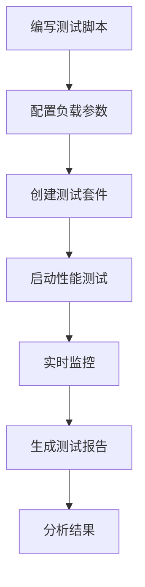

# 🚀 性能测试使用指南

> 让您的系统在压力下依然优雅如初！这里是性能测试的完整攻略 ⚡

## 🎯 性能测试概述

### 什么是性能测试？

性能测试就像给您的系统做**体检**，通过模拟大量用户同时访问，检验系统在高负载下的表现：

- **响应时间** - 系统处理请求的速度
- **吞吐量** - 单位时间内处理的请求数量
- **并发能力** - 同时处理用户的最大数量
- **稳定性** - 长时间运行的可靠性
- **资源使用** - CPU、内存、网络的使用情况

### 为什么选择Locust？

我们选择**Locust**作为性能测试框架，因为它：

- 🐍 **Python编写** - 与平台技术栈完美融合
- 📊 **实时监控** - 提供美观的Web界面
- 🔧 **灵活配置** - 支持复杂的测试场景
- 📈 **可扩展** - 支持分布式测试
- 🎯 **易于使用** - 简洁的API设计

## 🏗️ 性能测试架构

### 测试组件结构

```
🎭 Locust测试脚本 (LocustFunc)
    └── 📊 负载形状配置 (LocustShape)
        └── 📦 测试套件 (LocustSuite)
            └── 📈 测试结果 (LocustTestResult)
```

### 执行流程



## 📝 编写性能测试脚本

### 基础脚本结构

```python
from locust import HttpUser, task, between

class WebsiteUser(HttpUser):
    """
    网站用户行为模拟

    模拟用户在网站上的典型操作：
    - 访问首页
    - 用户登录
    - 浏览商品
    - 下单购买
    """

    wait_time = between(1, 3)  # 用户操作间隔1-3秒

    def on_start(self):
        """用户开始测试时的初始化操作"""
        self.login()

    def login(self):
        """用户登录"""
        response = self.client.post("/api/user/login", json={
            "username": "test_user",
            "password": "test_password"
        })
        if response.status_code == 200:
            self.token = response.json().get("token")

    @task(3)  # 权重为3，执行频率较高
    def view_homepage(self):
        """访问首页"""
        self.client.get("/")

    @task(2)  # 权重为2
    def view_products(self):
        """浏览商品列表"""
        self.client.get("/api/goods/get/by?current=1&pageSize=10")

    @task(1)  # 权重为1，执行频率较低
    def create_order(self):
        """创建订单"""
        if hasattr(self, 'token'):
            headers = {"Authorization": f"Bearer {self.token}"}
            self.client.post("/api/orders/create",
                           json={"product_id": 1, "quantity": 1},
                           headers=headers)
```

### 高级脚本特性

**1. 数据驱动测试**

```python
import random
from locust import HttpUser, task

class DataDrivenUser(HttpUser):
    """数据驱动的性能测试"""

    def on_start(self):
        # 准备测试数据
        self.test_users = [
            {"username": "user1", "password": "pass1"},
            {"username": "user2", "password": "pass2"},
            {"username": "user3", "password": "pass3"},
        ]

    @task
    def login_with_random_user(self):
        """使用随机用户登录"""
        user_data = random.choice(self.test_users)
        self.client.post("/api/user/login", json=user_data)
```

**2. 自定义负载形状**

```python
from locust import LoadTestShape

class StepLoadShape(LoadTestShape):
    """
    阶梯式负载增长

    模拟真实场景中用户数量的逐步增长：
    0-60秒：10个用户
    60-120秒：50个用户
    120-180秒：100个用户
    """

    step_time = 60
    step_load = 10
    spawn_rate = 10
    time_limit = 180

    def tick(self):
        run_time = self.get_run_time()

        if run_time < self.time_limit:
            current_step = run_time // self.step_time
            return (self.step_load * (current_step + 1), self.spawn_rate)

        return None
```

## 🎛️ 测试配置管理

### 同步测试脚本

平台会自动发现和同步Locust测试脚本：

1. **脚本目录结构**
```
locust_tests/
├── user_scenarios/
│   ├── login_test.py
│   └── registration_test.py
├── api_scenarios/
│   ├── goods_api_test.py
│   └── order_api_test.py
└── mixed_scenarios/
    └── full_workflow_test.py
```

2. **同步操作**
```bash
POST /api/locust_test/sync_locust_moudle
```

系统会自动：
- 扫描测试目录
- 解析脚本文档字符串
- 提取测试场景信息
- 更新数据库记录

### 负载形状配置

创建不同的负载模式：

```json
{
  "shape_name": "阶梯式负载",
  "shape_desc": "模拟用户数量逐步增长的场景",
  "shape_type": "step",
  "max_users": 100,
  "spawn_rate": 10,
  "duration": 300
}
```

**常用负载模式：**

- **恒定负载** - 固定用户数持续测试
- **阶梯负载** - 用户数分阶段增长
- **峰值负载** - 快速达到最大用户数
- **波浪负载** - 用户数周期性变化

## 📦 测试套件管理

### 创建性能测试套件

将相关的性能测试脚本组合成套件：

```json
{
  "suite_name": "电商系统性能测试套件",
  "suite_desc": "包含用户登录、商品浏览、订单创建等核心流程的性能测试",
  "locust_func_ids": [1, 2, 3, 5],
  "shape_id": 1,
  "test_env": "test"
}
```

### 套件执行配置

- **并发用户数** - 同时执行的虚拟用户数量
- **增长速率** - 用户数增长的速度
- **测试时长** - 测试执行的总时间
- **目标主机** - 被测试系统的地址

## 🚀 执行性能测试

### 启动测试

```bash
POST /api/locust_test/run_locust_test
```

```json
{
  "suite_id": 1,
  "title": "电商系统压力测试-双11预演",
  "users": 100,
  "spawn_rate": 10,
  "run_time": "10m",
  "host": "https://test-api.example.com"
}
```

### 实时监控

测试执行过程中可以实时查看：

**📊 关键指标**
- **RPS** (Requests Per Second) - 每秒请求数
- **响应时间** - 平均、最小、最大响应时间
- **错误率** - 请求失败的百分比
- **并发用户数** - 当前活跃的虚拟用户数

**📈 实时图表**
- 响应时间趋势图
- RPS变化曲线
- 错误率统计图
- 用户数增长图

### 测试控制

测试执行过程中支持：

- **暂停/恢复** - 临时暂停测试执行
- **停止测试** - 提前结束测试
- **调整负载** - 动态修改用户数和增长率
- **查看日志** - 实时查看测试日志

## 📊 结果分析

### 测试报告

测试完成后自动生成详细报告：

**📋 概览信息**
```
测试时长: 10分钟
总请求数: 15,432
成功请求: 15,201 (98.5%)
失败请求: 231 (1.5%)
平均RPS: 25.7
平均响应时间: 245ms
```

**📈 性能指标**
- **响应时间分布** - 50%、90%、95%、99%分位数
- **RPS统计** - 最大、最小、平均RPS
- **错误分析** - 错误类型和分布
- **资源使用** - 系统资源消耗情况

### 性能基线

建立性能基线，用于对比分析：

```json
{
  "baseline_name": "电商系统v1.0性能基线",
  "avg_response_time": 245,
  "max_rps": 45,
  "error_rate": 1.5,
  "cpu_usage": 65,
  "memory_usage": 78
}
```

### 趋势分析

对比历史测试结果，分析性能趋势：

- **性能回归** - 识别性能下降的版本
- **容量规划** - 预测系统容量需求
- **优化效果** - 验证性能优化的效果
- **瓶颈识别** - 发现系统性能瓶颈

## 🎯 最佳实践

### 测试策略

**1. 分层测试**
```
🔹 单接口性能测试 - 验证单个API的性能
🔹 业务流程性能测试 - 测试完整业务流程
🔹 混合场景性能测试 - 模拟真实用户行为
🔹 极限压力测试 - 找到系统的性能边界
```

**2. 测试环境**
- 使用与生产环境相似的测试环境
- 确保测试数据的充分性和真实性
- 隔离测试环境，避免干扰

**3. 监控策略**
- 同时监控应用和基础设施指标
- 设置合理的性能阈值和告警
- 记录详细的测试日志

### 脚本优化

**1. 性能优化**
```python
# 使用连接池
from locust import HttpUser
import requests

class OptimizedUser(HttpUser):
    def on_start(self):
        # 配置连接池
        self.client.mount('http://', requests.adapters.HTTPAdapter(
            pool_connections=10,
            pool_maxsize=10
        ))
```

**2. 数据管理**
```python
# 避免数据竞争
import threading

class ThreadSafeUser(HttpUser):
    def on_start(self):
        # 使用线程本地存储
        self.local_data = threading.local()
        self.local_data.user_id = self.generate_unique_user_id()
```

### 结果解读

**1. 关键指标理解**
- **响应时间** < 200ms (优秀), < 500ms (良好), > 1s (需要优化)
- **错误率** < 0.1% (优秀), < 1% (可接受), > 5% (严重问题)
- **RPS** 根据业务需求确定目标值

**2. 瓶颈识别**
- **CPU瓶颈** - 响应时间随用户数线性增长
- **内存瓶颈** - 出现内存溢出错误
- **数据库瓶颈** - 数据库相关操作响应时间过长
- **网络瓶颈** - 网络延迟和丢包率高

---

*性能测试就像给系统做马拉松训练，只有经过充分的压力测试，系统才能在关键时刻保持最佳状态 🏃‍♂️*
